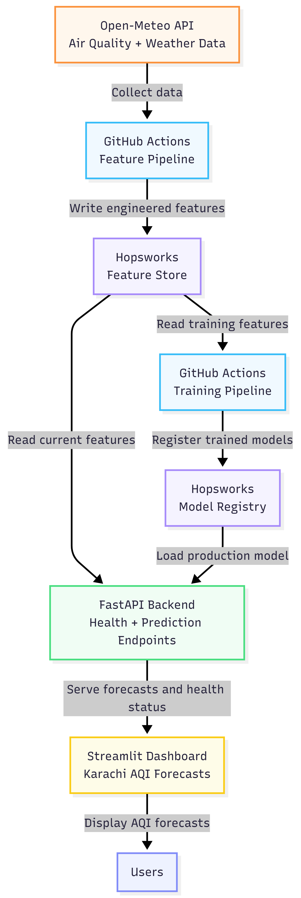
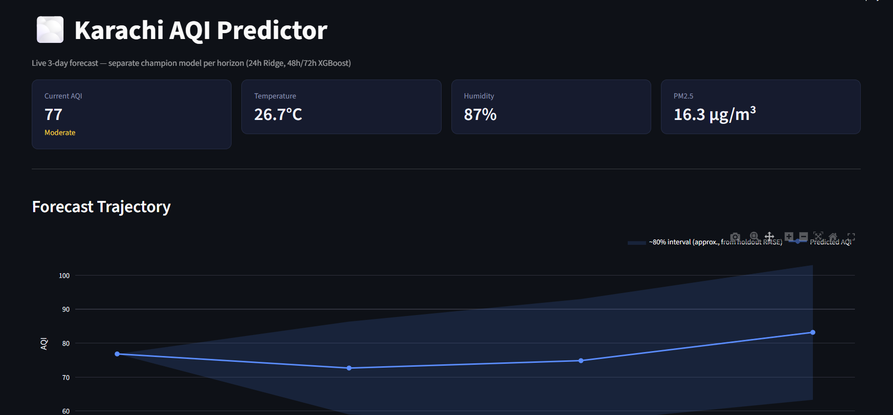
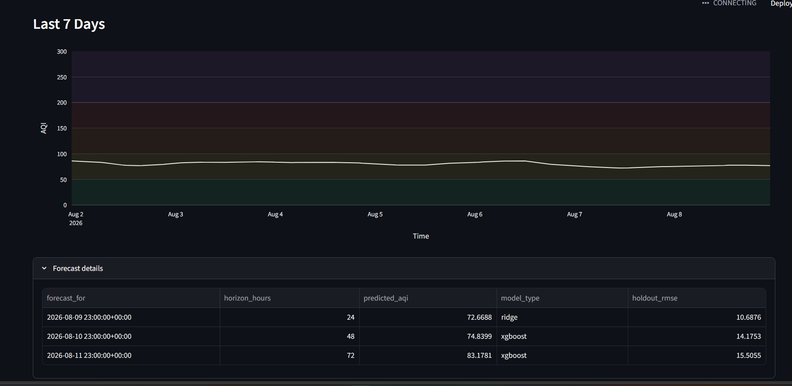

# Pearls AQI Predictor

End-to-end MLOps system that forecasts Karachi's Air Quality Index (AQI) up to 72 hours ahead, with automated data ingestion, model training, and a live dashboard for forecasts and alerts.

## Live URLs

- **Dashboard:** [aqi-predictor-pearls.streamlit.app](https://aqi-predictor-pearls.streamlit.app/)
- **Backend API:** [backend/](backend/) with FastAPI endpoints for health and predictions
- **Model Registry:** Hopsworks with separate champion models for 24h, 48h, and 72h horizons

## Features

- 24h / 48h / 72h AQI forecasts with forecast visualization and interval-style uncertainty bands
- Hourly feature pipeline using Open-Meteo data ingested through GitHub Actions into the Hopsworks Feature Store
- Daily model-training workflow with comparison across Ridge, Random Forest, XGBoost, and LSTM approaches
- LSTM experiment suite with multiple architecture configs such as baseline_64_32, wider_128_64, deeper_64_64_32, bidirectional_64_32, and regularized_96_48_lowlr
- SHAP-based feature selection and ablation analysis to identify a compact, high-performing feature set
- Tiered hazard alerts and dashboard-ready alert logic for advisory, unhealthy, and hazardous conditions
- Streamlit frontend + inference pipeline for serving forecasts from the Hopsworks-backed workflow

## Architecture



The architecture diagram above summarizes the end-to-end flow from Open-Meteo data ingestion to feature storage, model registration, and user-facing forecast delivery.

## Dashboard Preview

[](dashboard_ss/dashboard1.png)

[](dashboard_ss/dashbaord2.png)

Live at: [aqi-predictor-pearls.streamlit.app](https://aqi-predictor-pearls.streamlit.app/)

## Tech Stack

Python 3.11, scikit-learn, TensorFlow, XGBoost, SHAP, Hopsworks, GitHub Actions, Flask, Streamlit, Plotly, Pandas, and NumPy.

## Setup (Local Development)

```bash
conda create -n pearls_aqi python=3.11 -y
conda activate pearls_aqi
pip install -r requirements.txt
```

Create a `.env` file with:

```env
HOPSWORKS_API_KEY=<your_key>
HOPSWORKS_PROJECT=<your_project>
BACKEND_API_KEY=<shared_secret>
```

### Run locally

```bash
# Backend API
uvicorn backend.main:app --reload

# Dashboard
streamlit run app/dashboard.py
```

> The Streamlit dashboard loads models directly from Hopsworks and caches them on first run, so it does not need a separate backend deployment to function for local use.

## Project Structure

```text
app/                 # Streamlit dashboard UI
backend/             # FastAPI health and prediction endpoints
models/              # Prediction and training logic, including LSTM experiments
pipelines/           # Feature and training pipeline orchestration
utils/               # Shared helpers, metrics, logging, and alerts
data/                # Raw and processed datasets
EDA-outputs/         # EDA plots and visual analysis
dashboard_ss/        # Dashboard screenshots
scripts/             # Supporting notebooks and scripts
results/             # LSTM experiment results and saved outputs
```

## Status

The project is implemented and deployed with a working dashboard and inference workflow.

## Author

Built by Rabia Zulfiqar — AQI forecasting capstone project, 2026.
