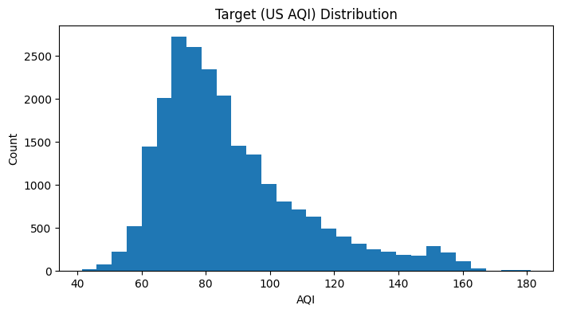
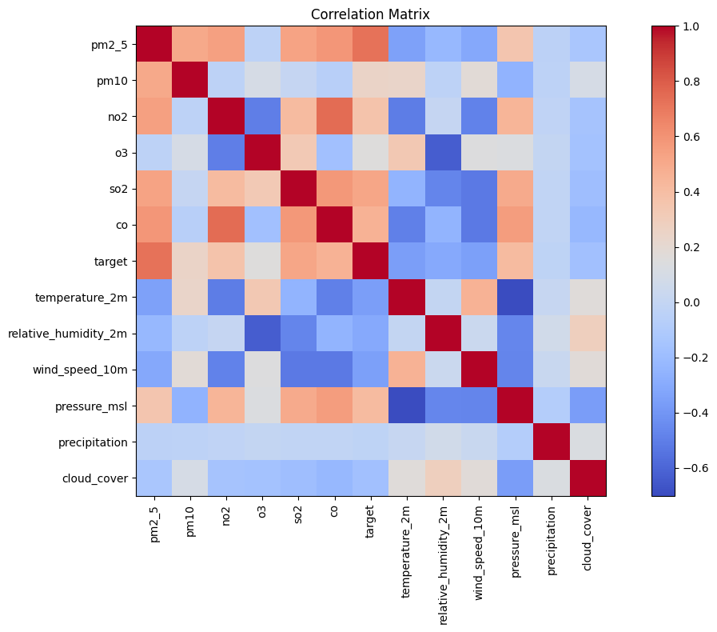
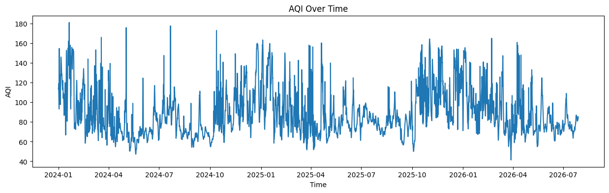
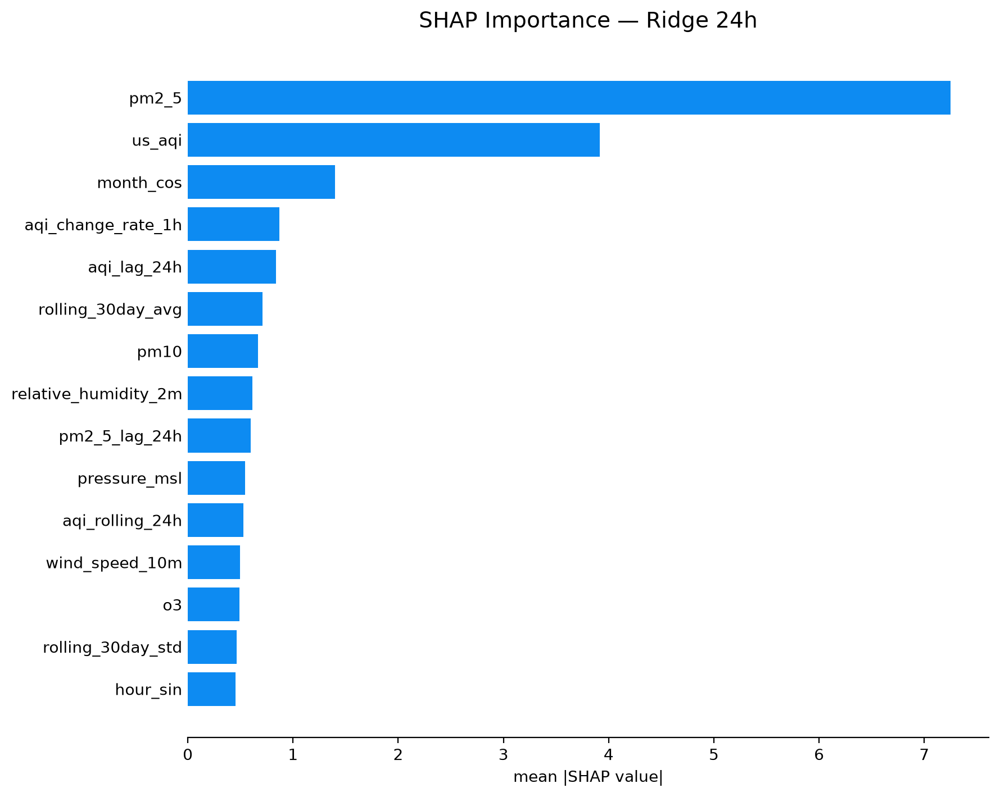
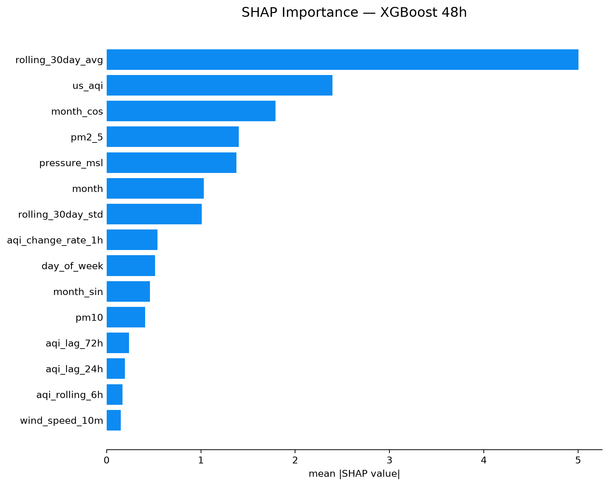
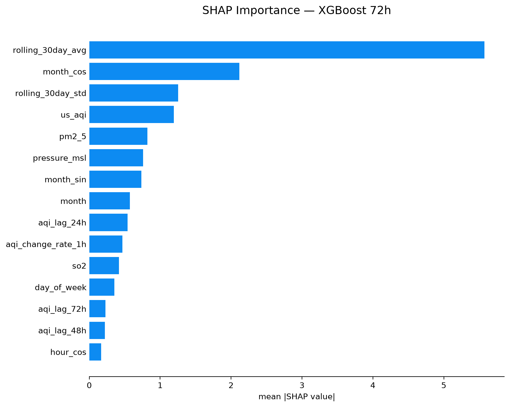
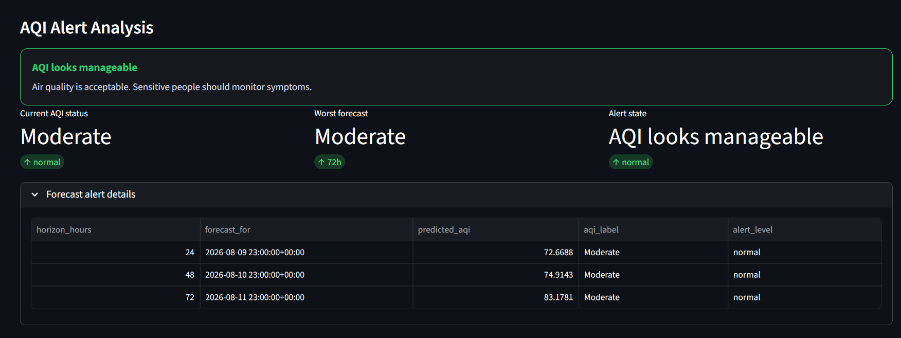

# Pearls AQI Predictor — Final Report

**Author:** Rabia Zulfiqar
**Tag:** v1.0-submission  
**Date:** August 2026

**Live dashboard:** [aqi-predictor-pearls.streamlit.app](https://aqi-predictor-pearls.streamlit.app/)  
**Repository:** [github.com/rabiazulfiqar1/Pearls-AQI-Predictor](https://github.com/rabiazulfiqar1/Pearls-AQI-Predictor)

---

## Table of Contents

1. [Executive Summary](#1-executive-summary)
2. [Problem Statement](#2-problem-statement)
3. [System Architecture and Automation](#3-system-architecture-and-automation)
4. [Data Sources](#4-data-sources)
5. [Exploratory Data Analysis](#5-exploratory-data-analysis)
6. [Feature Engineering and Pipeline](#6-feature-engineering-and-pipeline)
7. [Model Training and Selection](#7-model-training-and-selection)
8. [Serving Layer: Dashboard and API](#8-serving-layer-dashboard-and-api)
9. [Results and Observations](#9-results-and-observations)
10. [Future Work](#10-future-work)
11. [Conclusion](#11-conclusion)

---

## 1. Executive Summary

Pearls AQI Predictor is an end-to-end forecasting system for Karachi that turns environmental measurements into multi-horizon AQI predictions. The repository combines data collection, feature engineering, model comparison, inference logic, and a public dashboard into one reproducible workflow.

The current implementation uses a feature-store-backed approach to load the latest row, generate forecasts for 24h, 48h, and 72h, and present the results in a Streamlit-based interface. The project is designed to be practical, transparent, and easy to extend for future deployment and monitoring improvements.

---

## 2. Problem Statement

Karachi’s air quality varies significantly over time and directly affects daily decision-making for residents, commuters, and health-sensitive groups. A real-time AQI reading answers the question “what is the air quality now,” but a forecast answers the more useful question “what can I expect in the next day or two?”

This project addresses that gap by building a forecasting workflow that can generate multi-day AQI predictions from publicly available environmental data and present them through a user-friendly dashboard.

---

## 3. System Architecture and Automation

The system is organized into modular stages:

1. Data ingestion from public APIs
2. Feature engineering and feature-store preparation
3. Model training and evaluation
4. Forecast generation from the latest feature row
5. Dashboard presentation for end users

The main code paths are implemented in the repository folders [app](app), [models](models), [pipelines](pipelines), [utils](utils), and [config](config).

The dashboard uses the inference logic in [models/predict.py](models/predict.py), while the public UI is implemented in [app/dashboard.py](app/dashboard.py).

### 3.1 Technology stack and CI/CD

The project is implemented in Python 3.11. The main tools and services are:

| Area | Tools and technologies | Role in the system |
|---|---|---|
| Data ingestion | Open-Meteo API, `requests-cache`, `retry-requests` | Retrieves hourly air-quality and weather observations with caching and retry support. |
| Data processing | Pandas, NumPy, PyArrow | Cleans, transforms, stores, and prepares time-series features. |
| Feature store and registry | Hopsworks Feature Store and Model Registry, Delta Lake | Stores engineered features and versioned champion models for each forecast horizon. |
| Classical machine learning | scikit-learn Ridge and Random Forest, XGBoost | Trains and evaluates the classical forecasting models. |
| Deep learning and explainability | TensorFlow/Keras LSTM, SHAP | Runs the sequence-model experiments and ranks influential features for model pruning. |
| Automation and CI/CD | GitHub Actions, `pip` dependency caching, Ubuntu runners | Automates hourly feature updates and daily champion retraining and registration. |
| Serving and visualization | Streamlit, Plotly | Provides the public dashboard, forecast charts, and alert presentation. |
| API layer | FastAPI, Uvicorn, Pydantic | Exposes health and prediction endpoints through the backend service. |
| Configuration and artifacts | `python-dotenv`, Joblib, JSON/CSV files | Loads secrets from environment variables and persists model and feature metadata. |

The CI/CD workflow is split into two scheduled GitHub Actions jobs. The hourly feature pipeline checks out the repository, installs the pinned dependencies with Python 3.11, fetches the latest Open-Meteo data, engineers the features, and writes them to Hopsworks. The daily champion-retraining pipeline trains Ridge for 24h and XGBoost for 48h/72h, applies a regression guard, and registers successful models in the Hopsworks Model Registry. Both jobs can also be started manually from GitHub Actions, and Hopsworks credentials are supplied through repository secrets rather than stored in source code.

The workflow definitions remain in [.github/workflows](.github/workflows). After submission, the scheduled workflows were disabled because of an unrelated platform issue; the automation code remains part of the repository and is documented here as the intended production workflow.

---

## 4. Data Sources

The project relies on environmental data from Open-Meteo, including air-quality and weather signals. The feature pipeline combines pollutant data such as PM2.5, PM10, NO₂, O₃, SO₂, and CO with meteorological variables such as temperature, humidity, wind, and pressure.

The resulting time-series data is engineered into supervised learning features so the model can learn both short-term persistence and longer-term seasonal structure.

---

## 5. Exploratory Data Analysis

The repository contains several EDA artifacts in [EDA-outputs](EDA-outputs). These images were used to understand both the target behavior and the important variables for forecasting.

### 5.1 Target distribution

This plot shows the spread of AQI values in the dataset and supports the decision to model the target as a continuous variable rather than a simple categorical alert flag.

### 5.2 Feature correlation

This figure highlights the strongest relationships between AQI and the engineered variables, helping identify the most informative signals for prediction.

### 5.3 AQI trend over time

The time-series view confirms that AQI shows temporal structure and persistence, which is a key motivation for using lag-based and rolling features.

### 5.4 SHAP-based importance

SHAP explainability and the resulting horizon-specific feature selection are discussed in [Section 7.3](#73-shap-explainability-and-feature-selection).

---

## 6. Feature Engineering and Pipeline

The project uses a structured feature-engineering workflow to transform raw environmental observations into model-ready rows.

### 6.1 Engineered features

The feature pipeline includes:

- lag-based AQI features
- rolling statistics and short-term change measures
- temporal variables such as month and hour-based structure
- weather and pollutant features that reflect the physical drivers of air quality

These features are designed to capture both persistence and short-term dynamics in the AQI signal.

### 6.2 Feature-store integration

The latest feature rows are loaded from the repository’s feature-store-based workflow, and the prediction pipeline uses those rows as the basis for inference. This keeps the training and serving paths aligned with the same feature definitions.

---

## 7. Model Training and Selection

Several model families were evaluated in the repository to compare predictive behavior. The saved classical-model results in [results/shap_pruned_results.csv](results/shap_pruned_results.csv) capture the holdout performance for the pruned Ridge, Random Forest, and XGBoost models across the 24h, 48h, and 72h horizons.

### 7.1 Holdout comparison summary

| Model | 24h RMSE | 24h MAE | 24h R² | 48h RMSE | 48h MAE | 48h R² | 72h RMSE | 72h MAE | 72h R² |
|---|---:|---:|---:|---:|---:|---:|---:|---:|---:|
| Ridge_pruned | 10.69 | 7.35 | 0.516 | 14.68 | 10.35 | 0.087 | 15.55 | 11.05 | -0.024 |
| RF_pruned | 11.28 | 7.72 | 0.461 | 14.62 | 10.18 | 0.094 | 18.01 | 14.10 | -0.374 |
| XGBoost_pruned | 10.82 | 7.40 | 0.504 | 14.16 | 9.92 | 0.150 | 15.51 | 11.81 | -0.019 |

These are holdout scores from the saved evaluation artifact. The corresponding training scores are higher, which is expected because the models are measured on data they were not fit on. Across horizons, the 24h task is clearly the easiest, while the 48h and 72h forecasts show the normal drop in skill that comes with longer lead times.

The earlier naive baseline remains the simplest lower-bound reference in the project’s classical comparison workflow. In the saved artifact available here, the pruned models are the ones with complete RMSE, MAE, and R² rows, so those are the values shown above.

### 7.2 LSTM experiment results

The repository also contains a dedicated LSTM experiment workflow in [models/lstm.py](models/lstm.py) and the saved results in [results/LSTM_results.md](results/LSTM_results.md). Several architecture configurations were tested:

- baseline_64_32
- wider_128_64
- deeper_64_64_32
- bidirectional_64_32
- regularized_96_48_lowlr

The best-performing LSTM configuration was wider_128_64, which achieved the lowest validation loss and the strongest validation metrics across all horizons. Its reported results were:

| Horizon | RMSE | MAE | R² |
|---|---:|---:|---:|
| 24h | 15.35 | 11.60 | 0.400 |
| 48h | 17.45 | 13.10 | 0.232 |
| 72h | 18.82 | 13.97 | 0.135 |

On the independent holdout set, the same configuration achieved:

| Horizon | RMSE | MAE | R² |
|---|---:|---:|---:|
| 24h | 11.22 | 7.83 | 0.376 |
| 48h | 12.72 | 9.16 | 0.141 |
| 72h | 13.24 | 9.66 | -0.009 |

These results show that the LSTM was competitive at short horizons but that the longer-horizon task remained more difficult. The horizon-wise R² decay matches the way the AQI signal itself becomes less autocorrelated at longer lead times, which suggests the model is approaching the ceiling imposed by the data rather than simply underfitting.

The broader interpretation is straightforward: if more historical rows become available, especially beyond the current free-tier Hopsworks data volume, the LSTM should have more room to improve. In the current setup, the data size is the main constraint, so better results are most likely to come from a larger training history rather than a radically more complex architecture.

The same evaluation pattern is also consistent with a public-health-oriented forecast system that uses 80%-target conformal intervals: the right failure mode is to be slightly conservative, not overconfident.

### 7.3 SHAP explainability and feature selection

SHAP (SHapley Additive exPlanations) was used to make the feature-selection step more interpretable. For each forecast horizon, the analysis calculated the mean absolute SHAP value for each candidate feature and ranked features by their average contribution magnitude across the evaluation data. The top 15 features from each ranking were then used to train the corresponding production champion model, so the 24h, 48h, and 72h models can use different feature subsets.

The selected champion and the five highest-ranked features for each horizon were:

| Horizon | Champion | Top SHAP-ranked features (in descending order) |
|---|---|---|
| 24h | Ridge | `pm2_5`, `us_aqi`, `month_cos`, `aqi_change_rate_1h`, `aqi_lag_24h` |
| 48h | XGBoost | `rolling_30day_avg`, `us_aqi`, `month_cos`, `pm2_5`, `pressure_msl` |
| 72h | XGBoost | `rolling_30day_avg`, `month_cos`, `rolling_30day_std`, `us_aqi`, `pm2_5` |

The rankings show a clear change with forecast distance. The 24h model relies most strongly on current PM2.5, the current US AQI value, and recent AQI dynamics. At 48h and 72h, the 30-day rolling AQI average becomes the strongest signal, followed by seasonal structure such as `month_cos`; longer-range forecasts therefore depend more on baseline conditions and seasonality than on the latest pollutant measurement alone. The increasing importance of rolling statistics also supports the use of temporal aggregation in the feature pipeline.

These are global importance results: a larger mean absolute SHAP value means that a feature generally changes the model output more, but it does not indicate whether that feature increases or decreases a particular forecast. Directional explanations would require dependence plots or local SHAP explanations for individual predictions. The SHAP rankings should also be interpreted as model associations rather than causal effects, since correlated pollutant and temporal variables can share attribution.

### 7.4 Model choice

The repository’s modeling workflow is built around comparing several approaches while keeping the feature definitions consistent. That makes it possible to judge whether a simpler model is sufficient or whether a more expressive model is justified.

---

## 8. Serving Layer: Dashboard and API

The dashboard is implemented in [app/dashboard.py](app/dashboard.py), and the prediction logic is implemented in [models/predict.py](models/predict.py).

### 8.1 Dashboard screenshots

The dashboard presents:

- a current-condition summary
- a three-day prediction table
- a forecast trajectory chart
- AQI category-based visual cues

### 8.2 Prediction workflow

At inference time, the pipeline:

1. loads the latest feature row,
2. selects the appropriate model for each horizon,
3. generates the 24h/48h/72h forecast values,
4. returns the results to the interface for display.

The repository also includes a FastAPI backend in [backend/main.py](backend/main.py) with health and prediction endpoints under [backend](backend), but this API is currently a local/repository service and is not publicly deployed. The live Streamlit app does not call FastAPI: it imports [models/predict.py](models/predict.py) directly, reads the latest feature data from Hopsworks, and downloads the registered champion models. Therefore, Streamlit Cloud can run the dashboard directly from GitHub without FastAPI, provided that `HOPSWORKS_API_KEY` and `HOPSWORKS_PROJECT` are configured in the app's Streamlit Secrets.

The first Streamlit load can still be slow because it must authenticate with Hopsworks, read the feature group, and download three model artifacts. Hopsworks sessions and service handles are cached in [utils/hopsworks_client.py](utils/hopsworks_client.py), and the dashboard caches the resulting forecast. Deploying FastAPI would improve the user experience only after the dashboard is changed to call a deployed API whose models and feature data are already warm or cached; deploying the current backend unchanged would not remove the Hopsworks startup work.

---

## 9. Results and Observations

The project produced a complete workflow that is useful for both experimentation and presentation.

### 9.1 What the repository demonstrates

- A working end-to-end AQI prediction pipeline
- Reproducible feature engineering from environmental inputs
- A model-comparison framework with documented metrics
- A public-facing dashboard experience
- Clear integration between training-time logic and serving-time inference

### 9.2 Practical takeaway

The results show that AQI forecasting is feasible with a modest project structure and publicly available data, especially for short-horizon prediction. The repository is therefore a strong proof-of-concept and a solid base for future extensions.

---

## 10. Future Work

Several improvements are natural next steps:

- add stronger uncertainty estimates and interval reporting
- expand the out-of-time evaluation framework
- improve deployment robustness and monitoring
- add richer alerting and user-facing features
- extend the system to more locations or more granular forecasting horizons

---

## 11. Conclusion

Pearls AQI Predictor is a complete and practical AQI forecasting project for Karachi. It brings together data, modelling, inference, and visualization into one cohesive workflow and shows how a public-facing air-quality forecast can be built from repository-based ML components.

The project is now positioned not just as an experimental notebook workflow, but as a usable forecasting application with clear documentation, visuals, and a dashboard interface.
